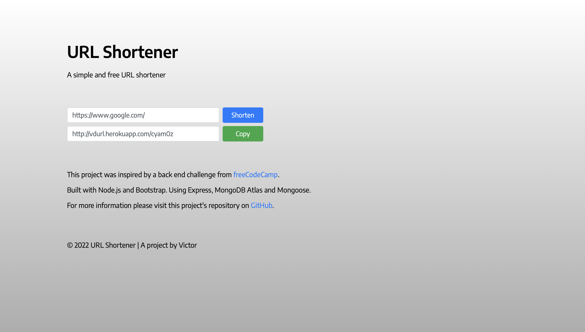

# URL Shortener
https://vdurl.herokuapp.com/

## Technologies
`HTML` `CSS` `JavaScript` `Bootstrap` `Node.js` `Express.js` `Mongoose`

## Description
* A responsive app to shorten URLs.
* Built with Node.js and Bootstrap. Using Express, MongoDB Atlas and Mongoose.
* Make a POST request entering a valid URL address and get a unique shortened URL.
* Make a GET request to the API endpoint `[url]/:shortened` to be redirected to the original URL.

## Credits
* Database hosted on [MongoDB Atlas](https://www.mongodb.com/atlas).
* Unique random ID strings generated by [Generate Unique ID](https://github.com/steve-232/generate-unique-id).
* App running on Heroku. [Learn more](https://devcenter.heroku.com/articles/getting-started-with-nodejs).

## Screenshot


## Running Locally
In the project directory, you can run:

```
$ npm install
$ npm start
```

The app should now be running on [http://localhost:3000](http://localhost:3000).

**Important**: You need to create a .env file in the project directory and store the following variable:

`MONGO_URI='mongodb+srv://<username>:<password>@cluster0.uxh57.mongodb.net/<database>?retryWrites=true&w=majority'`

This will connect the project to a MongoDB database. Be sure to change `<username>`, `<password>` and `<database>` to your own MongoDB information.